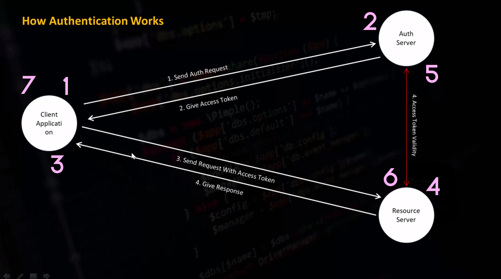

# LARAVEL-LUMEN-API

## 1. installation

- Install Lumen by issuing the Composer create-project command in your terminal:

  ```php
  composer create-project --prefer-dist laravel/lumen blog
  ```

- built-in PHP development server:

  ```php
  php -S localhost:8000 -t public
  ```

## 2. File Structure

1. controllers: our app logics.
2. middlewares: API security here.
3. migrations: Database schema here.
4. model: Data model here
5. routes: Endpoints for the API.
6. .env: Database Connection.
7. web: Main Routing Point

## 3. Methods For Rest API

1. $router->get($uri, $callback);
2. $router->post($uri, $callback);
3. $router->put($uri, $callback);
4. $router->delete($uri, $callback);

<hr/>

- ### Meaning of URI: Uniform Resource Identifier
- ### routing configuration

  ```php
  $router->get('/get', function (){
      return "I am get method";
  });
  $router->post('/post', function (){
      return "I am post method";
  });
  $router->put('/put', function (){
      return "I am put method";
  });
  $router->delete('/delete', function (){
      return "I am delete method";
  });

  ```

## 4. Route Parameters

1. Required Parameters
2. Optional Parameters

- ### Required Parameters example [Single Parameters]

  ```php
  $router->post('/name/{value}', function($value){
      return $value;
  });
  ```

- ### Required Parameters example [Multiple Parameters]

  ```php
  $router->post('/name/{nameValue}/age/{ageValue}', function($nameValue, $ageValue){
      return 'Name is '.$nameValue.' & age is '.$ageValue;
  });
  ```

- ### Optional Parameters example [Multiple Parameters]

  ```php
  $router->post('/name/{nameValue}[/{cityValue}]', function($nameValue, $cityValue=null){
      return 'Name is '.$nameValue.' & city '.$cityValue;
  });
  ```

## 5. What is Rest API

A REST API (Representational State Transfer API) is a web service architecture that follows the principles of scalability, statelessness, and uniform interface. It provides a standardized way for clients to interact with server resources over the internet.

### Principles of REST API

- **Stateless Communication**: REST APIs do not store client state on the server. Each request contains all the necessary information for the server to process it.

- **Client-Server Architecture**: REST APIs follow a client-server model where the server provides resources and services, and the client consumes them.

- **Uniform Interface**: REST APIs have a consistent and uniform interface, typically using HTTP methods like GET, POST, PUT, DELETE to perform operations on resources.

- **Resource-Based**: REST APIs are based on resources identified by unique URLs. Clients can interact with these resources by making requests to their respective URLs.

- **Stateless Operations**: Each request is independent and self-contained. The server does not rely on the state of previous requests.

## 6. Controller [How to create controller?]

- ### What is controller?

  Controller is a class to organize the logics of http request. Controller gather data from model class and prepare it for request.

- ### How to create controller?

  Make a controller file in this location `app\Http\Controllers` name as the `MyController`, write this code in the MyController

- ### Example

  ```php
  <?php
  namespace App\Http\Controllers;
  use App\Models\User;
  class MyController extends Controller
  {
    public function My($name){
        return "My name is ".$name;
    }
  }

  ```

## 7. Controller [How to use controller?]

We use controller class as callback function in route like 'ControllerClass@Method'

- ### Example

  ```php
  $router->get('/{name}', 'MyController@My');
  ```

- ### Controller [How Pass Parameter To Controller?]

- ### Example

  ```php
  $router->get('/{id}', 'MyCon@My')
  ```

## 8. API Response

- Simple String Json Response and Body
- Json Response Body From Various Types Of Array
- Redirect Response To Another URI
- Understanding Download Response

- ### Response Area:
  - Body
  - Header
- ### Response Type:
  - Simple String
  - JSON
  - XML
  - Download
  - Redirect

## 9. Response Area [Header]

- write this code in the api controller file as your controller folder
  ```php
  public function My($name){
      return response($name)
          ->header('name', $name)
          ->header('age', '45')
          ->header('username', 'HHJN')
          ->header('city', 'Dhaka');
  }
  ```

## 10. JSON Response in Body From Array

- ### Example
  write this code in api controller file
  ```php
  public function My()
  {
      $myArray = [
          "Peter" => "53",
          "Ben" => "73",
          "Joe" => "34",
      ];
      return response()->json($myArray);
  }
  ```

## 11. JSON Response in Body From Array

- ### Response Redirect
  This is routing configuration
  ```php
  $router->get('/first', 'MyController@first');
  $router->get('/second', 'MyController@second');
  ```
  This is controller code
  ```php
  public function first(){
    return redirect('second');
  }
  public function second(){
      // return 'second';
    return redirect('first');
  }
  ```
- ### Response Download

  - first paste any file in the public folder , like audio, video or text, etc , i can make a text file in the public folder. my file is `HHJN.txt`
  - and also make a function in the api controller , i my case our api controller is MyController

  ```php
  public function Download(){
      return response()->download('HHJN.txt');
  }
  ```

## 12. Sending And Catching

- ### Way of Send And Catch: [URL Parameter & JSON Data]

  1. controller code

  ```php
  namespace App\Http\Controllers;
  use App\Models\User;
  use Illuminate\Http\Request;

  class MyController extends Controller
  {
      function Catch(Request $request){
          return $request;
      }
  }
  ```

  - routing file code

  ```php
  $router->post('/catch', 'MyController@Catch');
  ```

- ### Way of Send And Catch: [Header Parameter]

  controller code

  ```php
  namespace App\Http\Controllers;
  use App\Models\User;
  use Illuminate\Http\Request;

  class MyController extends Controller
  {
      function Catch(Request $request){
          return $request->header('PASS YOUR HEADER KEY');
      }
  }
  ```

## 13. Database Operation

- ### Database Connection

1. create a database and table in the xampp
2. insert data

- ### Step: 1 | import the DB class in the controller file

```php
use illuminate\support\Facades\DB;
```

- ### Step: 2 | if the DB class access we will enable the Facades folder go to the `app.php` then write this code

```php
$app->withFacades();
```

- ### Step: 3 | write this method in the controller

```php
function testConn(){
  $dbname = DB::connection()->getDatabaseName();
  return $dbname;
}
```

- ### Step: 4 | routing configuration

```php
$router->get('/', 'ExampleController@testConn');
```

- ### Step: finally | output is your database name show up

- ### How to get data or select data
  this is the ExampleController code
  ```php
  function testConn(){
      $dbname = DB::connection()->select("SELECT * FROM details");
      return $dbname;
  }
  ```

## 14. How to GET data in lumen API

- ### this is the controller get method code

```php
function DetailsSelect(Request $request)
{
  $request = DB::select("SELECT * FROM details");
  return $request;
}
```

## 15. How to POST data in lumen API

- ### this is the controller get method code
  we will insert data `mysql prepared statements` method

```php
function DetailsCreate(Request $request)
{
  $name = $request->input("name");
  $roll = $request->input('roll');
  $city = $request->input('city');
  $phn = $request->input('phn');
  $class = $request->input('class');
  $SQL = "INSERT INFO details ('name', 'roll', 'city', 'phn', 'class') VALUES (?, ?, ?, ?, ?)";
  $result = DB::insert($SQL, [$name, $roll, $city, $phn, $class]);

}
```

## 16. How to DELETE data in lumen API

- ### this is the controller delete method code
  we will delete data `mysql prepared statements` method

```php
function DetailsDelete(Request $request)
{
    $id = $request->input('id');
    $SQL = "DELETE FROM `details` WHERE `id`=?";
    $result = DB::delete($SQL, [$id]);
    if ($result){
      return "Data Delete successful";
  } else {
      return "Data Delete Fail ! Try Again";
  }
}
```

## 17. How to UPDATE data in lumen API

- ### this is the controller update method code
  we will update data `mysql prepared statements` method

```php
 function DetailsUpdate(Request $request)
{
  $roll = $request->input('roll');
  $city = $request->input('city');
  $phn = $request->input('phn');
  $SQL = "UPDATE `details` SET `city`=?,`phn`=? WHERE `roll`=?";
  $result = DB::update($SQL, [$city, $phn, $roll]);
  if ($result) return "Success";
  else return "Fail";
}
```

## 18. Laravel Query Builder

- ### Retrieving All Rows From A Table

```php
function AllRow(){
  $result = DB::table('details')->get();
  return $result;
}
```

- ### Retrieving A Single Row / Column From A Table

```php
function Row(){
  $result = DB::table('details')->where('roll', 1222)->first();
  return $result->name;
}
```

- ### Retrieve a single row by its id column value

```php
function Rows(){
  $result = DB::table('details')->find(7);
  return $result->name;
}
```

- ### Retrieving A List Of Column Values

```php
 function Rows(){
  $result = DB::table('details')->pluck('roll');
  return $result;
}
```

- ### Retrieving Specify a custom key column

```php
 function Rows(){
   $result = DB::table('details')->pluck('name', 'roll');
  return $result;
}
```

## 19. Laravel Query Builder

- ### Counting

```php
function Counting(){
  $result = DB::table('details')->count();
  return $result;
}
```

- ### Maximum

```php
function Maximum(){
  $result = DB::table('details')->max('roll');
  return $result;
}
```

- ### Average

```php
function Maximum(){
  $result = DB::table('details')->avg('roll');
  return $result;
}
```

- ### Summation

````php
function Maximum(){
  $result = DB::table('details')->sum('roll');
  return $result;
}
- ### Summation

```php
function Maximum(){
  $result = DB::table('details')->sum('roll');
  return $result;
}
````

- ### Insert (Query Builder)

```php
function insert(){
  $name = $request->input('name');
  $roll = $request->input('roll');
  $city = $request->input('city');
  $phn = $request->input('phn');
  $class = $request->input('class');
  // return $class;
  $result = DB::table('details')->insert([
      'name'=>$name,
      'roll'=>$roll,
      'city'=>$city,
      'phn'=>$phn,
      'class'=>$class
  ]);
  if($result) return "Success";
  else return "Fail";
}
```

- ### Update (Query Builder)

```php
function update(Request $request){
  $name = $request->input("name");
  $id = $request->input("id");
  $result = DB::table('details')->where('id', $id)->update(['name'=>$name]);
  if($result) return "Success";
  else return "Fail";
}
```

- ### Delete (Query Builder)

```php
function update(Request $request){
  $name = $request->input("name");
  $id = $request->input("id");
  $result = DB::table('details')->where('id', $id)->update(['name'=>$name]);
  if($result) return "Success";
  else return "Fail";
}
```

## Lumen generator [click ME](https://github.com/flipboxstudio/lumen-generator)

- ### Eloquent QRM

  - Each database table has a corresponding "Model"
  - Used to interact with that tables 1015
  - Models allow you to query for data in
  - All Eloquent models extend Illuminate\Database\Eloquent\Model class
  - command php artisan make:model details Count dbs

- ### How to get Counting Element

  this is the controller code

  ```php
  <?php

  namespace App\Http\Controllers;

  use App\Models\DetailsModel;
  use Illuminate\Support\Facades\DB;

  class myController extends Controller
  {
      function getData()
      {
          $result =  DB::table('details')->count();
          return $result;
      }
  }

  ```

- ### How to get `Max value` in the column Element

  this is the controller code

  ```php
  <?php

  namespace App\Http\Controllers;

  use App\Models\DetailsModel;
  use Illuminate\Support\Facades\DB;

  class myController extends Controller
  {
      function getData()
      {
          $result =  DB::table('details')->max('YOUR_COLUMN_NAME');
          return $result;
      }
  }

  ```

- ### How to get `Min value` in the column Element

  this is the controller code

  ```php
  <?php

  namespace App\Http\Controllers;

  use App\Models\DetailsModel;
  use Illuminate\Support\Facades\DB;

  class myController extends Controller
  {
      function getData()
      {
          $result =  DB::table('details')->max('YOUR_COLUMN_NAME');
          return $result;
      }
  }

  ```

- ### How to get `Avg value` in the column Element

  this is the controller code

  ```php
  <?php

  namespace App\Http\Controllers;

  use App\Models\DetailsModel;
  use Illuminate\Support\Facades\DB;

  class myController extends Controller
  {
      function getData()
      {
          $result =  DB::table('details')->avg('YOUR_COLUMN_NAME');
          return $result;
      }
  }
  ```

- ### How to get `Sum value` in the column Element

  this is the controller code

  ```php
  <?php

  namespace App\Http\Controllers;

  use App\Models\DetailsModel;
  use Illuminate\Support\Facades\DB;

  class myController extends Controller
  {
      function getData()
      {
          $result =  DB::table('details')->sum('roll');
          return $result;
      }
  }
  ```

- ## Database Migration
  - Version control for your database
  - Allow to create table programmatically ef
  - Allow to modify table programatically initia
  - To share the application's database schema
- ### Generating And Running Migrations

  - php artisan make:migration create_users_table to create migration file
  - Placed in your database/migrations directory
  - Migration file name contains a timestamp
  - --table and --create options used to indicate the name of the table
  - php artisan migrate to run migration ple dbs.options

- ### To Create Table
  ```php
  php artisan make:migration create_users_table
  ```
  migration file Schema code
  ```php
   Schema::create('users', function (Blueprint $table) {
      $table->bigIncrements('id');
      $table->String('name');
      $table->String('email');
      $table->String('password');
      $table->timestamps();
  });
  ```
  - ### To Execute Migration
  ```php
  php artisan migrate
  ```
  - ### To Execute Migration
  ```php
  php artisan migrate
  ```
  - ### Reset Migration also call the delete
  ```php
  php artisan migrate:reset
  ```
  - ### Reset And Execute Again / mySQL all data is delete
  ```php
  php artisan migrate:refresh
  ```

## How Authentication Works

  

---

---

---

---

---

---

---

---

---

---

---

---

---

---

---

---

---

---

---

---

---

---

---

---

---

---

---

---

## 15. package manager in laravel

- ### In the laravelthe common package manager site is [packagist](https://packagist.org/)

- ### installation

```php
composer require noitran/opendox
```

- ### setup the bootstrap/app file configuration

```php
$app->register(Noitran\Opendox\ServiceProvider::class);
$app->configure('opendox');
```

- ### create a file as name as the `api-docs.yml`

  In the Inside of this file some code insert it

- ### Finally we will run this code
  ```php
  php artisan opendox:transform
  ```
